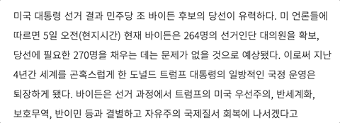

# Playful Text Summarization
Text summary is difficult. But I don't like automatic summaries. Because it doesn't fully reflect my thoughts. So I made a new way of summarizing.

## Features
- Overlaping highlights
- Text visualization
- Playful interaction

## Technologies
- reactjs
- [selection.js](https://simonwep.github.io/selection/)

## Live Demos
[Try it yourself](https://wooknick.github.io/playful-text-summarization/)
